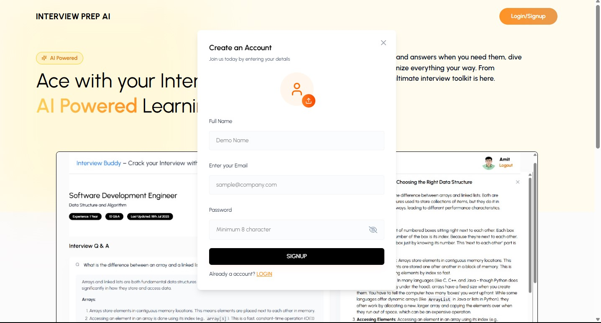
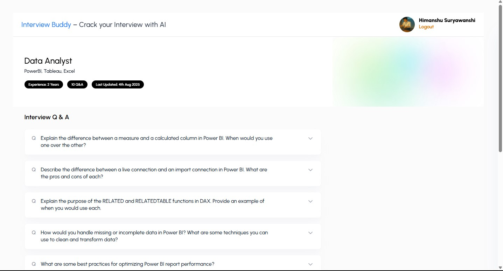

# Interview Buddy 🎯

**Interview Buddy** is a full-stack MERN (MongoDB, Express.js, React.js, Node.js) web application that generates personalized technical interview questions to help job seekers streamline their preparation through realistic, dynamic question sets.

---

## 🚀 Features

✨ **Dynamic Question Generation**  
🔐 **Secure User Authentication**  
🧾 **Session Tracking with History**  
💻 **Responsive UI with React.js & Tailwind CSS**  
🌐 **RESTful API Architecture**  
🗃️ **Persistent Storage with MongoDB**

---

## 📸 Preview

### 🔐 Login Page  


---

### 🧠 Dashboard with Generated Questions  


---

## 🎥 Demo (Video/GIF)

>  demo video or screen recording in `.gif` or `.mp4` format inside the `assets/` folder. Then, update the link below accordingly.


---

## 🛠️ Tech Stack

This project is built using the MERN stack:

-   
  **MongoDB** – NoSQL Database 🟢

-   
  **Express.js** – Backend Framework ⚙️

-   
  **React.js** – Frontend Library ⚛️

-   
  **Node.js** – Runtime Environment 🟩
---

## 📂 Project Structure

```
InterviewBuddy/
├── client/                 # React frontend
│   └── src/
│       └── components/
├── server/                 # Express backend
│   └── routes/
│   └── controllers/
├── .env                    # Environment variables
├── README.md
```

---

## ⚙️ Setup Instructions

### 🔧 Prerequisites

- 📦 Node.js (v16+ recommended)  
- 🛢️ MongoDB (local or cloud via Atlas)

### 📝 1. Clone the repository

```bash
git clone https://github.com/varenyamsingh/crack-interview.git
cd interview-buddy
```

### 🔐 2. Setup Environment Variables

Create a `.env` file in the `server/` directory with the following:

```
MONGO_URI=your_mongo_connection_string
JWT_SECRET=your_jwt_secret_key
```

### 📥 3. Install Dependencies

**Backend:**

```bash
cd server
npm install
```

**Frontend:**

```bash
cd ../client
npm install
```

### ▶️ 4. Run the Application

```bash
# Terminal 1: Backend
cd server
npm start

# Terminal 2: Frontend
cd client
npm run dev
```

The app will run at: `http://localhost:5173`

---

## 💡 Core Highlights

✨ Built with the modern MERN stack:  
- ⚛️ **React.js** for a fast, interactive UI  
- ⚙️ **Express.js** + 🟩 **Node.js** for scalable backend APIs  
- 🟢 **MongoDB** for reliable data storage  

🔁 Modular structure and clean architecture make the project easily extensible.  

---

## 🔗 Live Preview

🌍 [**Click here to view the live demo**](################)

---

## 🤝 Contributing

💡 Have suggestions or improvements?  
Feel free to fork the project and submit pull requests. Contributions are always welcome!
---
